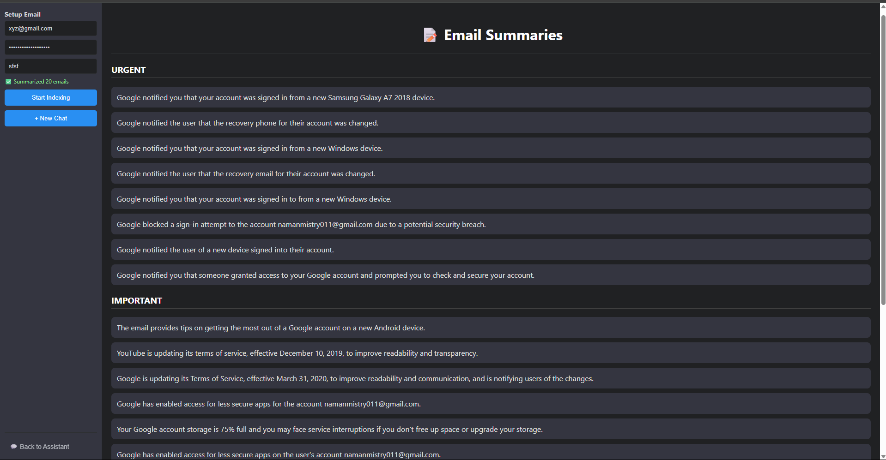

# 📧 Email RAG Assistant — Ask, Summarize, and Categorize Your Emails with AI

Are you overwhelmed by thousands of emails?  
Struggling to find that one important detail in a flood of messages?  
Wish you had an AI assistant that could instantly summarize or answer questions about your inbox?

Introducing **Email RAG Assistant** — a powerful Retrieval-Augmented Generation (RAG) solution built to help you:

✅ Summarize emails with one-liners  
✅ Categorize emails automatically (Urgent, Important, Promotion, etc.)  
✅ Ask natural language questions about your email history  
✅ Index and search emails **locally** with privacy in mind  


---

## 🔍 Features

- ✨ Ask questions like:
  - "Did we ever talk about project XYZ in a client meeting?"
  - "How many emails are there?"
  - "How many emails from xyz@gmail.com?"
  - "How many emails did I receive on March 3rd, 2021 in the morning from xyz@email.com?"
  - "Anything important in the last 50 emails?"
  - "Summarize my last 100 emails."

- 📩 View one-liner summaries of each email  
- 🗂️ Automatic LLM-based email categorization (Urgent, Important, Promotion, Other)  
- 🛡️ All email processing and indexing happens locally — ensuring **maximum privacy**  
- 🚀 Easy to use, intuitive UI — just add your credentials and start indexing

---

## ⚙️ Installation & Setup

### 1. Clone the Repository

```bash
git clone https://github.com/your-username/email-rag-assistant.git
cd email-rag-assistant
````

### 2. Set Up Frontend

```bash
cd my-chat-app
npm install
```

### 3. Set Up Backend

```bash
cd ../email_rag_app
python -m venv venv
source venv/bin/activate  # On Windows: venv\Scripts\activate
pip install -r requirements.txt
```

---

## 🧠 How to Use

### Step 1: Start the Servers

```bash
# In one terminal window (backend)
cd email_rag_app
python app.py
```

```bash
# In another terminal window (frontend)
cd my-chat-app
npm start
```

### Step 2: Enter Your Credentials

In the sidebar:

* Add your **Gmail email ID**
* Add your **IMAP App Password** (see below for how to generate)
* Add your **NVIDIA NIMs API key**

Click **"Start Indexing"** to begin processing your emails.

---

## 🔐 How to Generate IMAP Gmail App Password

1. Enable 2-Step Verification

   * Go to [Google Security Settings](https://myaccount.google.com/security)
   * Click **2-Step Verification** and follow the prompts

2. Generate App Password

   * Go to [App Passwords](https://myaccount.google.com/apppasswords)
   * Choose **App** = Mail
   * Choose **Device** = Your device or "Other"
   * Click **Generate**
   * Copy the **16-character App Password**

---

## 🧠 How to Get NVIDIA NIMs API Key

1. Visit the [NVIDIA Build Portal](https://developer.nvidia.com/nvidia-ai-foundation-models)
2. Login or create an account
3. Browse to the API Catalog
4. Choose a model and click **"Get API Key"**

---

## 🔮 Planned Enhancements

* ✅ Add support for **local LLMs** (privacy-first)
* 🧪 Explore integration with **Microsoft’s BitNet models**
* 🤖 Enhance RAG with **advanced multi-step retrieval strategies**

---

## 📢 Contributing

This is the first development release — bugs may be present.
You're **welcome and encouraged** to contribute!

* File issues or feature requests on GitHub
* Send questions or suggestions to **[nmistry6@asu.edu](mailto:nmistry6@asu.edu)**
* Let's build this open email intelligence tool together!

---

## 📜 Disclaimer

> This tool is intended for personal productivity. While email data is processed locally, **inference requests are sent to NVIDIA NIMs API**. To ensure full privacy, consider contributing a local LLM integration. We welcome all contributions and feedback.

---

## 📸 Screenshot




---

