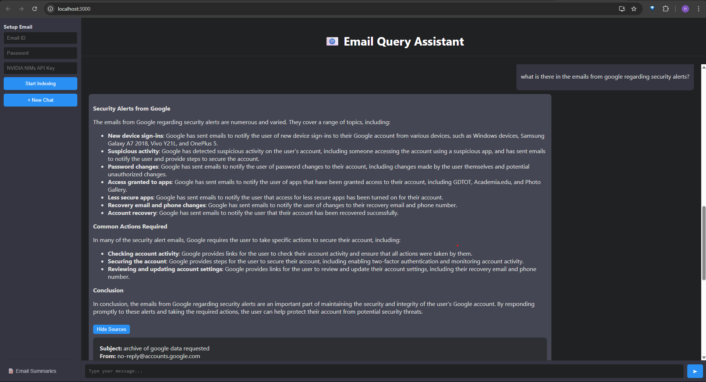

# 📧 Email RAG Chat Assistant — Powered by NVIDIA NIMs

## Transform the Way You Search Your Emails

**Email RAG Chat Assistant** is a next-generation conversational interface designed to help you **query**, **summarize**, and **navigate** your email data effortlessly.  
Powered by **NVIDIA NIMs API**, this smart assistant unlocks deep retrieval-augmented insights from your email inbox — with natural language interaction and one-click summaries.

---

## 🚀 Key Benefits

- **💬 Conversational Email Search**  
  Find answers from your email history by simply asking questions — no filters, no keywords, just natural language.

- **📝 One-Line Email Summaries**  
  Browse organized, bite-sized summaries of your emails to quickly scan and understand your inbox content.

- **⚡ Powered by NVIDIA NIMs API**  
  Harness enterprise-grade AI from NVIDIA's cutting-edge cloud models, eliminating the need for local model setup or hardware limitations.

- **🔒 User-Controlled Email Ingestion**  
  Securely index your email data by providing your Email ID, Password, and NVIDIA NIMs API Key through the intuitive interface.

- **🖥️ Beautiful Dark-Mode Interface**  
  A modern, distraction-free chat experience inspired by the best AI chat tools on the market.

---

## 🌐 How It Works

1. **Provide your Email ID, Password, and NVIDIA NIMs API Key.**
2. **Click "Start Indexing" to process your inbox.**
3. **Switch between Chat Mode and Email Summary Mode with a single click.**
4. **Interact naturally with your email data or browse organized summaries.**
5. *Get back the sources it used to answer your questions.*

---

## 🛠️ Technology Stack

- **Frontend:** React.js
- **Backend:** Flask (Python)
- **AI Engine:** NVIDIA NIMs API
- **RAG Pipeline:** LangChain + ChromaDB
- **Styling:** Custom Dark Theme UI

---

## 📸 Product Screenshot

> Demonstrating the fully integrated chat and summary experience:

---
